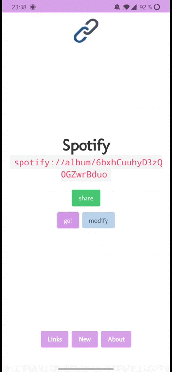

# deep-links

[](https://app.netlify.com/sites/app-deep-links/deploys)

Easily test deep links for your mobile and web apps [here](https://app-deep-links.netlify.app).



## Project setup

```
yarn install
```

### Compiles and hot-reloads for development

```
yarn serve
```

### Compiles and minifies for production

```
yarn build
```

### Run your unit tests

```
yarn test:unit
```

### Lints and fixes files

```
yarn lint
```

### Customize configuration

See [Configuration Reference](https://cli.vuejs.org/config/).
